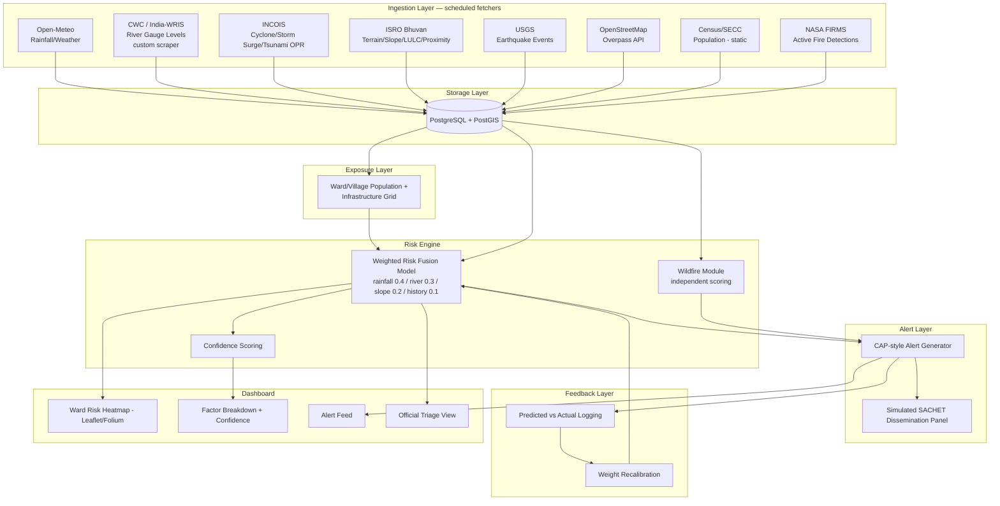
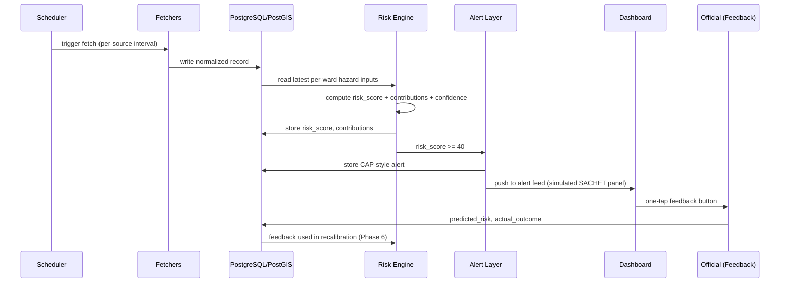

# PRAHARI-AI — Complete AI-Assisted Development Playbook

**National Multi-Hazard Impact-Based Decision Intelligence Layer — Smart India Hackathon (v2, Feasibility-Hardened Edition)**

This playbook converts the PRAHARI-AI Project PDF and Build Guide PDF into copy-paste-ready prompts you can feed to Claude, Gemini, ChatGPT, Cursor, or Windsurf, in build order, to go from an empty repository to the demo described in the source documents.

**Source-of-truth rule used throughout this playbook:** where the Build Guide PDF and the Project PDF differ or overlap on technical detail (code, formulas, schedules, thresholds), the **Build Guide is authoritative**. Nothing below invents features, APIs, datasets, credentials, or claims not present in the two PDFs. Anything not explicitly stated in the PDFs but reasonably needed to make a prompt runnable (e.g., a specific file name, a specific test-framework choice) is flagged inline as **[ASSUMPTION]** or **[OPTIONAL ENHANCEMENT]** — treat these as free to change.

**Core build principle (stated in the Build Guide, applies to every prompt below):** build your own module structure, naming conventions, and code. Use publicly documented data-source behaviour (API formats, page structures) as reference only — never copy code or architecture layouts from any existing project.

---

## How to Use This Playbook

1. Work top to bottom — each phase prompt assumes the previous phases exist.
2. Paste each prompt block as-is into your AI coding tool of choice inside the project repository.
3. Every prompt embeds its own acceptance criteria — do not move to the next phase until those criteria are met.
4. Section 20 contains the **Final Master Coding Prompt** — a single consolidated prompt an LLM (or coding agent) can use to build the entire system end-to-end if you don't want to run phase-by-phase.
5. Scope discipline is load-bearing to this project (see Section 6.5 of the Build Guide) — Tier 1 must never be cut; Tier 2 and Tier 3 are cut in that fixed order under time pressure. Every relevant prompt below tags its content with its Tier.
6. **Section 1a is a gap-fill addendum**, added after cross-checking this playbook line-by-line against both source PDFs. It captures pitch/narrative and a few technical facts that exist in the Project PDF but were not yet folded into any prompt above — read it once before Section 18 (Documentation) so those facts make it into the actual deliverables (README, DATA_SOURCES, JUDGE_QA, etc.) rather than staying stranded in this note.

---

## 1. System Overview (Source of Truth Recap)

**Hazard coverage:** flood, landslide, cyclone/tsunami, earthquake response, forest fire.

**Problem statement (Project PDF §1):** IMD, CWC/India-WRIS, GSI, DRDO/DGRE, and INCOIS each detect one hazard in isolation. No system fuses these feeds with hyperlocal exposure data (population, schools, hospitals) into a ward/village-level actionable decision. This is a documented "impact-based forecasting gap," implicated in the Kerala (2018) and Wayanad (2024) disasters.

**Solution (Project PDF §2):** A decision-intelligence layer sitting between existing hazard-detection agencies and NDMA's SACHET dissemination platform. It does not replace any government system — it fuses inputs and adds the missing translation step: hazard signal → hyperlocal exposure overlay → weighted risk score → specific recommended action → CAP-formatted alert routed toward SACHET's existing pipeline.

**Tiering (Build Guide §6.5 / Project PDF §3.3) — fixed in advance, never improvised:**
- **Tier 1 (never cut):** Flood + Landslide fusion for one pilot district, dashboard, CAP-style alert generation, backtest against Kerala 2018 or Wayanad 2024.
- **Tier 2 (cut second-to-last):** Feedback-loop demo button and before/after recalibration slide.
- **Tier 3 (cut first):** Wildfire module, tsunami module, earthquake rapid-response module — each architecturally independent.

---

## 1a. Gap-Fill Addendum — Source Facts Not Yet Represented Elsewhere in This Playbook

**Added on cross-check against both source PDFs.** Every prompt above already tracks the Build Guide closely. This section captures Project PDF content that exists in the source material but was not yet quoted, referenced, or embedded anywhere else in this playbook. Nothing here is new invention — every line is traceable to a specific PDF section. Fold each bullet into the corresponding phase's docs/code comments where noted.

### 1a.1 Problem-statement facts (Project PDF §1) — missing detail

The existing Section 1 summary compresses the five-agency silo list. Two specific facts from the source were dropped in that compression and should be restored in `README.md` / `DATA_SOURCES.md` (Section 18):
- IMD's role includes **Mission Mausam AI forecasts**, in addition to rainfall/nowcasting — cite this alongside the Open-Meteo substitution note so the substitution is explicit about what capability gap it stands in for.
- GSI's landslide susceptibility/forecasting coverage is **currently limited to 3 districts: Kalimpong, Darjeeling, and Nilgiris** — this is the concrete evidence behind "GSI's landslide role is filled by a derived proxy" and should be quoted verbatim in `DATA_SOURCES.md` and in the pitch's opening problem slide, not just asserted generically.

### 1a.2 Government Integration (Project PDF §7) — full detail beyond the Section 13 security prompt

Section 13 (Authentication & Security) uses Project PDF §7 only for its access-control implication. The following facts from the same section were not carried anywhere and belong in `README.md` / `ARCHITECTURE.md`:
- PRAHARI-AI **consumes public/API data only** from IMD-equivalent, CWC, GSI-equivalent, DRDO, and INCOIS sources — explicitly **no new data-collection burden on any agency**.
- Alerts are published in CAP format **structured for NDMA's existing SACHET pipeline**, which Project PDF §7 describes as already connecting Alert Generating Agencies to Alert Disseminating Agencies across **TSPs, TV, radio, cable, and satellite** — this specific multi-channel list should appear in the simulated-dissemination panel's "About / how this would work in production" copy (extends the Section 8 dissemination-panel requirement).
- District Collectors / SDMAs receive the dashboard as a plug-in to their **existing** response workflow, not a new one.
- Final decision authority always remains with human officials — PRAHARI-AI is a **decision-support co-pilot, not an autonomous actor**. (Section 13 already implies this for access control; add the verbatim framing to UI copy/docs too, since it is a direct judge-trust talking point, not just an access-control rationale.)

### 1a.3 AI / Technology Used (Project PDF §5) — items not carried into Section 12

Section 12 (AI/ML Model Prompt) covers the XGBoost, CNN/U-Net, LSTM, and graph-propagation future-work items correctly, but the source section names two further stack elements that were dropped:
- The upgrade path is named as **"Ensemble ML (XGBoost / Random Forest)"** — Section 12 currently names XGBoost only; add Random Forest alongside it wherever the upgrade path is documented.
- Geospatial stack additionally names **QGIS** (alongside PostGIS, already covered) for grid-overlay work, and **vector tiles for scale** as the specified approach for serving map data as the system grows beyond one pilot district. Add both to `ARCHITECTURE.md`'s geospatial-stack description (Section 18) and note vector tiles as an [OPTIONAL ENHANCEMENT] scaling path for the dashboard (Section 9) beyond the MVP's direct GeoJSON/PostGIS reads.

### 1a.4 Scalability narrative (Project PDF §9) — not previously quoted

Section 19 (Demo Flow) references the closing scalability line ("re-running the same pipeline... not rebuilding the system") but drops the comparison that gives it weight. Add to `README.md` and the demo's closing beat:
- The architecture is explicitly **hazard-agnostic and district-agnostic by design**; it scales horizontally across floods, urban flooding, landslides, cyclones, avalanches, and heatwaves.
- This is contrasted directly against **today's single-city, single-hazard pilots** named in the source: **Mumbai's flood nowcasting**, **Lucknow's pump-automation system**, and **GSI's 3-district landslide coverage** (same 3-district fact as 1a.1). Use this contrast explicitly in the closing pitch beat — it is what makes the scalability claim concrete rather than generic.

### 1a.5 "Why It Is Novel and Impactful" (Project PDF §11) — not represented anywhere

This entire source section has no counterpart in the playbook. Add it verbatim-in-spirit to `README.md`'s closing pitch section:
- Every individual data source PRAHARI-AI uses **already exists in India** — SACHET, IMD-equivalent nowcasts, GSI bulletins, Bhuvan, DRDO's geohazard R&D. The novelty is that **nothing currently fuses them** into one hyperlocal, cross-hazard, impact-based, action-generating layer.
- This is a gap **explicitly documented in Indian early-warning research**, and is the specific failure point behind real, recent casualties.
- The one-line pitch distillation to reuse verbatim in UI/docs/demo narration: **"PRAHARI-AI turns 'it will rain 200mm' into 'these 40 houses must evacuate by 6 PM'"** — the exact translation step India's own researchers say is missing.

### 1a.6 "Why SIH Judges Would Select It" (Project PDF §12) — not represented anywhere

Also entirely absent elsewhere in the playbook. Add as a dedicated `JUDGE_QA.md` preamble or `README.md` closing section (extends Section 18's documentation prompt):
- **Evidence-grounded** — built on named, current, documented gaps in NDMA/IMD/GSI/CWC systems, not invented problems.
- **Strengthens government infrastructure instead of duplicating it** — realistic adoption path via SACHET (ties directly to 1a.2 above).
- **Realistically buildable as a working MVP** in hackathon time, using mostly free data, with a fallback for every fragile source (ties to the Section 3 fallback table).
- **Honest about its limits** — does not claim to predict earthquakes, does not overclaim accuracy, states weight estimates as estimates (ties directly to the honest-framing block already required verbatim in Section 21's Final Master Prompt).
- **Directly ties to recent, real national tragedies** (Kerala 2018, Wayanad 2024), making the pitch concrete and emotionally resonant.
- **Self-improving by design** via the feedback loop — shows judges a path from hackathon prototype to real deployment.

### 1a.7 Consolidated Suggested Timeline (Build Guide §12 / Project PDF §14) — not previously assembled as one table

Individual timing facts (Week 1 scraper build, Week 1 backtest-data confirmation, etc.) are scattered correctly across Sections 5, 11, and 17, but the source's own top-level weekly plan was never assembled as a single reference table. Add this to `SCOPE_AND_TIERS.md` (Section 18) as the authoritative build cadence:

| Period | Focus |
|---|---|
| Week 1 | Tier 1 ingestion pipeline (CWC scraper + Bhuvan fallback wired in from Day 1, Bhuvan token requested Day 1) + exposure grid + confirm backtest historical-data availability |
| Week 2 | Risk scoring (with the stated weight justification) and alert generation working end to end |
| Week 3 | Dashboard polish + feedback-loop demo (Tier 2) + Tier 3 modules only if ahead of schedule |
| Hackathon days | Backtest finalisation, bug fixes, pitch rehearsal — including the fallback/limitation answers (Section 18's JUDGE_QA.md) |

If time is limited, the cut order is fixed in advance (Section 1, Tiering): Tier 3 hazard modules go first, Tier 2 feedback-loop polish second. The Tier 1 core — flood + landslide fusion, dashboard, and backtest — is never cut, since it carries the most weight in judging.

---

## 2. High-Level Architecture





---

## 3. Repository / Project Structure Prompt

**Tier: 1 | Phase: 0 (Setup)**

```
Create the initial repository structure for PRAHARI-AI, a national multi-hazard impact-based
decision intelligence layer described below. Do not copy any existing project's folder layout —
design your own structure consistent with the components listed.

SYSTEM COMPONENTS (from the PRAHARI-AI Build Guide, source of truth):
- Ingestion layer: one independent scheduled fetcher module per data source
  (Open-Meteo, CWC/India-WRIS, INCOIS advisories, INCOIS tsunami OPR, ISRO Bhuvan,
  USGS, OpenStreetMap/Overpass, Census/SECC static data, NASA FIRMS)
- Storage layer: PostgreSQL with PostGIS for geospatial queries
- Exposure layer: static ward/village-level population + infrastructure grid
- Risk engine: weighted scoring model producing a live risk score per ward, plus a
  separate wildfire scoring module
- Alert layer: converts risk scores into CAP-style structured alerts with recommended actions
- Feedback layer: logs predicted-vs-actual outcomes and recalibrates weights
- Dashboard: map-based frontend (React + Leaflet, or Streamlit + Folium if the team is small)

TECH STACK (Build Guide §1.2 — do not substitute other frameworks):
- Backend/API: Python, FastAPI
- Scheduler: APScheduler (or simple cron)
- Database: PostgreSQL + PostGIS
- ML/scoring: Python (pandas, numpy) — no ML library required for MVP; XGBoost is an
  optional future upgrade path only (Build Guide §5.7), not part of MVP scope
- Frontend: React + Leaflet (default) OR Streamlit + Folium (team-size contingency,
  Build Guide §5, Project PDF §3.6)
- Hosting (demo): local Docker Compose, or free-tier cloud (Render/Railway)

REQUIREMENTS:
1. Propose a full repository tree (backend, frontend, ingestion fetchers as isolated
   modules — one file/module per source, database migrations, tests, docs, docker config,
   scripts for demo data and backtesting).
2. Each fetcher module must be isolated so one source failing cannot break another
   (Build Guide §3.1).
3. Include a top-level README.md stub describing the multi-hazard, impact-based-forecasting
   mission (Project PDF §1–2) and the Tier 1/2/3 scope-cut order (Build Guide §6.5).
4. Include a `.env.example` listing every external credential needed: Bhuvan API token,
   NASA FIRMS MAP_KEY (free, no-cost), and a PostgreSQL connection string. Do NOT invent
   any additional credentials — only these are named in the source documents.
5. Set up Python dependency management (requirements.txt or pyproject.toml) including:
   fastapi, uvicorn, apscheduler, psycopg2/asyncpg, sqlalchemy or similar ORM with PostGIS
   support (e.g. GeoAlchemy2), requests, pandas, numpy, beautifulsoup4 (for the CWC scraper).
6. Set up frontend dependency management for the chosen stack.

ACCEPTANCE CRITERIA:
- `docker compose up` (once Phase "DevOps" is complete) will be able to bring up backend +
  database + frontend from this structure with no manual file moves.
- Folder names make the Tier 1 / Tier 2 / Tier 3 module boundary visually obvious (e.g.
  wildfire, tsunami, and earthquake modules should be easy to isolate/disable).
- Every fetcher lives in its own file/module.
```

---

## 4. Database Schema Prompt

**Tier: 1 | Phase: 1**

```
Design and implement the PostgreSQL + PostGIS database schema for PRAHARI-AI based on the
following confirmed data model (Build Guide §1.1, §3.2, §4, §5, §6.2, §8.1).

REQUIRED TABLES / ENTITIES (do not add speculative tables beyond what supports these):

1. hazard_readings (raw ingested records — one common format for every fetcher)
   Fields, matching the Build Guide's common record format exactly:
     source        text        e.g. "open_meteo", "cwc", "incois", "bhuvan", "usgs",
                                     "osm", "firms", "incois_tsunami"
     location_id   text        e.g. ward identifier "ward_014"
     hazard_type   text        e.g. "rainfall", "river_level", "slope", "earthquake",
                                     "fire", "tsunami_potential"
     value         numeric
     unit          text        e.g. "mm_per_hr"
     observed_at   timestamptz
     fetched_at    timestamptz
   Add a geospatial column (PostGIS geometry/geography Point) for the reading location.

2. wards (exposure/vulnerability grid — Phase 2)
     ward_id                 pk
     district                text
     boundary                PostGIS geometry(Polygon)
     population              numeric        (from Census/SECC)
     infrastructure_count    integer        (schools+hospitals from OSM Overpass)
     vulnerability_score     numeric        (normalised combination of population
                                             density + critical infrastructure count)
     slope_proxy_cached      numeric        (from Bhuvan, cached — re-fetched
                                             periodically, e.g. monthly, not every cycle)
     last_bhuvan_fetch_at    timestamptz

3. risk_scores (Risk Engine output — Phase 3)
     id
     ward_id            fk -> wards
     computed_at         timestamptz
     risk_score          numeric(0-100)
     rainfall_intensity  numeric
     river_level_trend   numeric
     slope_saturation_proxy numeric
     historical_incident_density numeric
     contribution_rainfall numeric   -- weight * input, for explainability
     contribution_river    numeric
     contribution_slope    numeric
     contribution_history  numeric
     confidence_score    numeric     -- heuristic: higher when more inputs fresh/recent

4. wildfire_scores (separate module — Build Guide §5.6)
     id
     ward_id fk -> wards
     computed_at timestamptz
     detection_count integer
     avg_frp numeric               -- fire radiative power
     dryness_context numeric       -- from Open-Meteo (low rainfall/high temp)
     wildfire_risk_score numeric

5. alerts (CAP-style — Build Guide §6.2)
     identifier    text pk        e.g. "PRAHARI-2026-000123"
     sender        text
     sent          timestamptz
     status        text           -- "Actual"
     msg_type      text           -- "Alert"
     event         text           -- e.g. "Flood risk"
     urgency       text
     severity      text
     certainty     text
     area_desc     text
     instruction   text
     ward_id       fk -> wards
     risk_band     text           -- "Monitor" | "Alert" | "Critical" (§6.1 thresholds)

6. feedback (Phase 6)
     id
     alert_id           fk -> alerts
     predicted_risk      numeric
     predicted_zone      text
     actual_outcome      text     -- 'yes' | 'no' | 'partial'
     timestamp           timestamptz

7. river_level_snapshot_cache (Build Guide §3.6)
     station_id
     district
     value
     fetched_at
     is_last_known_good  boolean  -- manually refreshed fallback flag

REQUIREMENTS:
- Use PostGIS geometry/geography types correctly for ward boundaries and point readings.
- Add indexes needed for: latest-reading-per-ward-per-source lookups, and ward-boundary
  spatial joins.
- Write migrations (Alembic or equivalent) rather than a single raw SQL dump.
- Add a seed/demo-data script placeholder (wired up fully in the "Sample/Demo Data" phase).

ACCEPTANCE CRITERIA:
- A query can retrieve, for a given ward, the most recent reading of each hazard_type.
- A query can retrieve the current risk_score + all four contributions + confidence for
  every ward in the pilot district in one call (needed by the dashboard's click-through
  panel, Build Guide §5.5, §7).
- Schema supports the cache-first-then-live read pattern required for CWC data
  (Build Guide §3.6) and Bhuvan (Build Guide §3.5).
```

---

## 5. Data Ingestion — Fetcher Prompts (Phase 1)

**Tier: 1 for Open-Meteo, CWC, Bhuvan (flood/landslide inputs). Tier 3 for USGS, FIRMS, INCOIS tsunami (independent hazard modules per §6.5).**

> Build Guide instruction embedded in every prompt below: "build your own module structure, naming conventions, and code — use publicly documented data-source behaviour (API formats, page structures) as reference only, never copy code or architecture layouts from any existing project." Each fetcher must run on its own schedule, normalise into the common record format (§3.2), and write to `hazard_readings`, isolated so one source's failure cannot break another (§3.1).

### 5.1 Open-Meteo Rainfall Fetcher — Tier 1

```
Build the Open-Meteo rainfall fetcher module for PRAHARI-AI.

SOURCE OF TRUTH (Build Guide §3.3):
- Endpoint: https://api.open-meteo.com/v1/forecast
- No API key required.
- Params: latitude, longitude, current=precipitation,rain, hourly=precipitation
- Timeout: 10s
- Reference behaviour only:
    import requests
    def fetch_rainfall(lat, lon):
        url = 'https://api.open-meteo.com/v1/forecast'
        params = {
            'latitude': lat, 'longitude': lon,
            'current': 'precipitation,rain', 'hourly': 'precipitation'
        }
        resp = requests.get(url, params=params, timeout=10)
        resp.raise_for_status()
        return resp.json()

REQUIREMENTS:
1. Write your own module (not a copy of the reference) that:
   - Loops over every ward centroid/coordinate in the pilot district.
   - Calls Open-Meteo for each and normalises the response into the common record
     format (source="open_meteo", location_id=ward_id, hazard_type="rainfall",
     value, unit="mm_per_hr", observed_at, fetched_at).
   - Writes to hazard_readings.
2. Error handling: catch request exceptions/timeouts per-ward so one ward's failure
   doesn't stop the loop; log failures; do not crash the scheduler job.
3. Schedule this job to run every 15 minutes, per Build Guide §3.9
   (scheduler.add_job(fetch_rainfall_job, 'interval', minutes=15)).
4. Unit test with a mocked HTTP response confirming correct normalisation.

ACCEPTANCE CRITERIA:
- Running the job populates hazard_readings with one row per ward per run.
- A failed request for one ward does not block others.
- Fallback note (source table, Build Guide §2): Open-Meteo is documented as low-risk /
  rarely fails, so no special fallback logic beyond standard retry/log is required.
```

### 5.2 CWC / India-WRIS River-Level Scraper — Tier 1

```
Build the CWC/India-WRIS river-gauge-level fetcher for PRAHARI-AI's pilot district.

SOURCE OF TRUTH (Build Guide §3.6, §2, Project PDF §3.1):
- CWC public data is often not a clean JSON API — for many stations you must parse the
  public HTML page for the pilot district's gauge station.
- Write your own parser (BeautifulSoup or similar) targeted at your specific pilot
  district's station page structure — do not reuse any existing project's scraper.

REQUIREMENTS:
1. Build this scraper in Week 1 (not later) — station page layouts vary and can change
   without notice, so failures must surface early.
2. Implement cache-first read pattern:
   - The dashboard/API layer must read from the cache (river_level_snapshot_cache /
     hazard_readings) first, then attempt a live fetch second — a scrape failure must
     never blank the UI.
3. Maintain a static "last known good" snapshot table for the pilot district's river
   level, manually refreshable before a demo, as a guaranteed fallback if the live
   scrape fails during judging (mark rows with is_last_known_good=true).
4. Normalise successfully scraped values into the common record format
   (hazard_type="river_level").
5. Schedule this job every 30 minutes (Build Guide §3.9:
   scheduler.add_job(fetch_river_level_job, 'interval', minutes=30)).
6. On scrape failure: log the failure, fall back to the last cached value, and flag the
   served value as stale (used later by the confidence-score heuristic, §5.4).
7. Add a small admin/CLI command to manually refresh the last-known-good snapshot before
   a demo.

ACCEPTANCE CRITERIA:
- If the live scrape is deliberately broken (e.g., wrong selector), the API layer still
  returns the last cached/known-good value rather than erroring.
- The system can state, and the code can demonstrate, "live where possible, cached
  fallback where the source is fragile" (Build Guide §3.6) as a working behaviour, not
  just a claim.
```

### 5.3 ISRO Bhuvan Terrain/Proximity Fetcher — Tier 1

```
Build the ISRO Bhuvan terrain and proximity fetcher for PRAHARI-AI's exposure grid.

SOURCE OF TRUTH (Build Guide §3.5, §2, Project PDF §3.2):
- Bhuvan exposes: Proximity endpoints (hospital/postal details, village geocoding),
  Thematic Statistics endpoints (land-use/land-cover at 50k and 250k scale), Routing,
  and Geoid conversion.
- Terrain/land-use data changes slowly — query once per ward during setup and cache the
  result, rather than re-polling on the rainfall/river schedule.
- Reference behaviour only:
    BHUVAN_TOKEN = 'YOUR_ACCESS_TOKEN'
    def fetch_bhuvan_lulc_statistics(district_code):
        url = 'https://bhuvan-app1.nrsc.gov.in/api/lulc/curr_lulc50k.php'
        params = {'token': BHUVAN_TOKEN, 'district_code': district_code}
        resp = requests.get(url, params=params, timeout=15)
        resp.raise_for_status()
        return resp.json()

    def fetch_bhuvan_proximity(lat, lon, facility_type='hospital'):
        url = 'https://bhuvan-app1.nrsc.gov.in/api/proximity/curr_proximity.php'
        params = {'token': BHUVAN_TOKEN, 'lat': lat, 'lon': lon, 'type': facility_type}
        resp = requests.get(url, params=params, timeout=15)
        resp.raise_for_status()
        return resp.json()

REQUIREMENTS:
1. Request Bhuvan API access/token on Day 1, in parallel with all other setup — never
   let token approval sit on the critical path (Build Guide §3.1, §3.5).
2. Implement the two reference endpoints as your own module: LULC thematic statistics
   (district-level, for the landslide slope/land-cover proxy) and proximity (nearest
   hospital, cross-checking the OSM-derived exposure grid).
3. Cache every result into the wards table (slope_proxy_cached, last_bhuvan_fetch_at)
   and only re-fetch periodically (e.g., monthly) — not every scheduler cycle.
4. Implement the explicit approval-latency fallback: if the Bhuvan token is not approved
   by the time the exposure grid (Phase 2) needs building, substitute Bhuvan's static
   bulk-download layers (slope, land-use, drainage) for the slope-saturation proxy. Since
   the design already caches this data after first fetch, swapping a bulk-download file
   in for a live API response must require no redesign — only the fetch step changes.
5. Document this fallback plainly in code comments and README so a live-API demo is
   never a single point of failure.

ACCEPTANCE CRITERIA:
- wards.slope_proxy_cached can be populated either via live Bhuvan API call or via a
  bulk-download file loader, without changing any downstream code that consumes it.
- A monthly re-fetch scheduler entry exists (or a documented manual re-fetch command).
```

### 5.4 USGS Earthquake Fetcher — Tier 3

```
Build the USGS earthquake fetcher for PRAHARI-AI's earthquake rapid-response module.

SOURCE OF TRUTH (Build Guide §3.4, §2):
- Free REST API, no key required.
- Endpoint reference:
    def fetch_recent_earthquakes(min_magnitude=3.0):
        url = ('https://earthquake.usgs.gov/earthquakes/feed/'
               'v1.0/summary/significant_week.geojson')
        resp = requests.get(url, timeout=10)
        resp.raise_for_status()
        return resp.json()['features']

REQUIREMENTS:
1. Implement your own module wrapping this endpoint, normalising each returned feature
   into the common record format (hazard_type="earthquake").
2. Schedule every 5 minutes (Build Guide §3.9:
   scheduler.add_job(fetch_earthquake_job, 'interval', minutes=5)).
3. This is a Tier 3 module (architecturally independent) — structure it so it can be
   disabled/removed without affecting flood/landslide (Tier 1) code paths.
4. Per Build Guide §10/§11 judge-question answers: this module does not attempt
   prediction. On a new event, it should trigger generation of a ward-level
   damage-priority map input (building age, population density, nearby landslide-prone
   zones) for NDRF response prioritisation — implement the data hook, using the existing
   exposure grid, that a rapid-response consumer (dashboard/alert layer) can call.

ACCEPTANCE CRITERIA:
- Fetcher runs independently; disabling it does not affect any Tier 1 fetcher or the
  risk fusion formula in §6.
- Earthquake events populate hazard_readings with hazard_type="earthquake".
```

### 5.5 OpenStreetMap / Overpass Fetcher — Tier 1 (Exposure Grid input)

```
Build the OpenStreetMap Overpass fetcher for PRAHARI-AI's exposure/vulnerability grid.

SOURCE OF TRUTH (Build Guide §4.2):
- Overpass API, free, static/occasional refresh.
- Reference query:
    [out:json];
    area[name="YOUR_DISTRICT"]->.searchArea;
    (
      node["amenity"="hospital"](area.searchArea);
      node["amenity"="school"](area.searchArea);
    );
    out body;

REQUIREMENTS:
1. Implement your own module that runs this style of query for the pilot district,
   parameterised (not hardcoded to "YOUR_DISTRICT").
2. Assign each returned node (hospital/school) to its containing ward using PostGIS
   spatial join against the wards.boundary polygon.
3. Store the resulting infrastructure_count per ward (wards table).
4. This is static/occasional-refresh data (Build Guide §2 fallback column: "Static — low
   risk once pulled") — no tight polling schedule required; a manual/one-time or
   monthly re-run command is sufficient.

ACCEPTANCE CRITERIA:
- wards.infrastructure_count is populated for every ward in the pilot district.
- Re-running the fetcher is idempotent (does not duplicate infrastructure counts).
```

### 5.6 Census/SECC Population Loader — Tier 1 (static)

```
Build the Census/SECC population loader for PRAHARI-AI's exposure grid.

SOURCE OF TRUTH (Build Guide §2, §4.1): free bulk download, static data, no live API.

REQUIREMENTS:
1. Implement a one-time/batch loader (not a scheduled fetcher, since this is static
   data per the source table) that ingests population figures per ward/village and
   writes wards.population.
2. Support re-import (idempotent upsert) if the underlying bulk file is refreshed later.
3. Do not invent a live API for this source — the Build Guide explicitly marks it
   static, N/A for fallback.

ACCEPTANCE CRITERIA:
- Every ward in the pilot district has a non-null population figure.
```

### 5.7 NASA FIRMS Wildfire Fetcher — Tier 3

```
Build the NASA FIRMS active-fire-detection fetcher for PRAHARI-AI's wildfire module.

SOURCE OF TRUTH (Build Guide §3.7, §2):
- Free, no-cost API key (MAP_KEY), obtained by registering on the FIRMS website.
- VIIRS 375m near-real-time product; requests scoped to a bounding box + lookback days.
- Reference:
    FIRMS_MAP_KEY = 'YOUR_FREE_MAP_KEY'
    def fetch_active_fires(min_lon, min_lat, max_lon, max_lat, days=1):
        url = (f'https://firms.modaps.eosdis.nasa.gov/api/area/csv/'
               f'{FIRMS_MAP_KEY}/VIIRS_SNPP_NRT/'
               f'{min_lon},{min_lat},{max_lon},{max_lat}/{days}')
        resp = requests.get(url, timeout=10)
        resp.raise_for_status()
        return resp.text  # CSV: latitude, longitude, brightness, confidence,
                           # acq_date, acq_time, frp, ...

REQUIREMENTS:
1. Implement your own module parsing the returned CSV (latitude, longitude, brightness,
   confidence, acq_date, acq_time, frp).
2. Assign each fire-detection point to a ward via spatial join.
3. Aggregate detections per ward over a rolling window (e.g., 24-48 hours) and compute a
   density/intensity score "similar in spirit to" clustering approaches used by
   comparable hazard-monitoring tools, but implemented independently — do not reuse any
   external codebase's clustering implementation. [If you choose DBSCAN or another
   clustering algorithm, use a standard library implementation (e.g. scikit-learn) called
   from your own module — do not copy another project's architecture around it.]
4. Schedule every 2 hours (Build Guide §3.9:
   scheduler.add_job(fetch_wildfire_job, 'interval', hours=2)), consistent with the
   1-3 hr satellite pass update frequency (§2).
5. This is a Tier 3, architecturally independent module (§5.6, §6.5) — it must not be
   merged into the flood/landslide weighted formula. It produces its own
   wildfire_risk_score written to the wildfire_scores table.

ACCEPTANCE CRITERIA:
- wildfire_scores is populated per ward with detection_count, avg_frp, dryness_context,
  and wildfire_risk_score.
- Disabling this fetcher does not affect the Tier 1 flood/landslide risk_scores pipeline.
```

### 5.8 INCOIS Advisories + Tsunami OPR Fetchers — Tier 3

```
Build the INCOIS fetchers for PRAHARI-AI's cyclone/storm-surge and tsunami-potential
modules.

SOURCE OF TRUTH (Build Guide §2, §3.8):
- INCOIS cyclone/storm-surge/ocean-state: public advisories/API, near real-time during
  events; fallback = cache last successful pull.
- INCOIS tsunami OPR reference:
    def fetch_incois_tsunami_events():
        url = ('https://tsunami.incois.gov.in/itews/DSSProducts/OPR/past90days.json')
        resp = requests.get(url, headers={'User-Agent': 'Mozilla/5.0'}, timeout=10)
        resp.raise_for_status()
        data = resp.json()
        generated_time = datetime.fromtimestamp(data['metadata']['generated'] / 1000)
        events = data['datasets']
        indian_ocean_keywords = ['Indonesia', 'Philippines', 'Andaman', 'Sumatra',
                                  'Myanmar', 'Bay of Bengal', 'Arabian Sea']
        relevant = [e for e in events
                    if any(k in e['REGIONNAME'] for k in indian_ocean_keywords)]
        return generated_time, events, relevant

REQUIREMENTS:
1. Implement your own module for the tsunami OPR endpoint exactly as scoped above
   (JSON endpoint, no key, filtered to the listed Indian-Ocean-relevant region keywords
   — do not invent additional keywords not in this list unless clearly marked
   [OPTIONAL ENHANCEMENT] and kept off by default).
2. Implement a second module for general INCOIS cyclone/storm-surge advisories per the
   source table; cache the last successful pull as the documented fallback.
3. Schedule the tsunami OPR job every 30 minutes (Build Guide §3.9).
4. This is a Tier 3, architecturally independent module.

ACCEPTANCE CRITERIA:
- Tsunami events are filtered to the specified regional keyword list before being
  written to hazard_readings.
- A failed live pull serves the last successfully cached advisory rather than erroring.
```

### 5.9 Scheduler Wiring Prompt — Tier 1

```
Wire all PRAHARI-AI fetchers into a single APScheduler instance.

SOURCE OF TRUTH (Build Guide §3.9):
    from apscheduler.schedulers.background import BackgroundScheduler
    scheduler = BackgroundScheduler()
    scheduler.add_job(fetch_rainfall_job, 'interval', minutes=15)
    scheduler.add_job(fetch_river_level_job, 'interval', minutes=30)
    scheduler.add_job(fetch_earthquake_job, 'interval', minutes=5)
    scheduler.add_job(fetch_wildfire_job, 'interval', hours=2)
    scheduler.add_job(fetch_tsunami_events_job, 'interval', minutes=30)
    scheduler.start()

REQUIREMENTS:
1. Implement this scheduling exactly as specified (these five intervals are explicit in
   the Build Guide — do not alter them).
2. Add the INCOIS cyclone/advisory job on an interval consistent with its "near
   real-time during events" description [ASSUMPTION: use 15-30 min if no explicit
   number is given elsewhere — flag this as an assumption in code comments].
3. Add the Bhuvan monthly re-fetch as a separate, much longer-interval job (or manual
   command) per §3.5 — do not run it on the same short cycle as rainfall.
4. Ensure each job wraps its fetcher call in error handling so one job's exception never
   stops the scheduler or other jobs.
5. Start the scheduler on FastAPI app startup; ensure clean shutdown on app stop.

ACCEPTANCE CRITERIA:
- All Tier 1 jobs (rainfall, river level) and enabled Tier 3 jobs run on their specified
  intervals without blocking each other.
- Deliberately raising an exception inside one fetcher does not stop the others from
  running on their next scheduled tick.
```

---

## 6. Phase 2 — Exposure and Vulnerability Grid Prompt

**Tier: 1**

```
Build the PRAHARI-AI exposure and vulnerability grid module (Phase 2).

SOURCE OF TRUTH (Build Guide §4.1):
- Divide the pilot district into wards/villages (use existing administrative boundaries
  if available, or a simple grid overlay if not).
- Attach population data from Census/SECC to each ward.
- Pull terrain, slope, and land-use context from the Bhuvan fetchers (cached).
- Pull schools, hospitals, and building footprints from OSM via Overpass for the same
  area.
- Compute a static vulnerability score per ward: a simple normalised combination of
  population density and count of critical infrastructure.

REQUIREMENTS:
1. Implement ward boundary ingestion (administrative boundary file if available, else a
   simple grid overlay you generate) into wards.boundary.
2. Wire in the Census/SECC loader (§5.6), Bhuvan fetcher (§5.3), and Overpass fetcher
   (§5.5) outputs into the wards table.
3. Implement the vulnerability_score calculation: normalise population density (0-100)
   and infrastructure_count (0-100) and combine them (state your combination method in
   code comments — the Build Guide specifies "a simple normalised combination," not an
   exact formula, so document your choice as consistent with that description).
4. Expose a function/endpoint returning the full exposure grid for the pilot district.

ACCEPTANCE CRITERIA (Build Guide §4, Deliverable):
- A PostGIS table (wards) where every ward has a fixed population figure, infrastructure
  count, and vulnerability score.
```

---

## 7. Phase 3 — Risk Fusion Model Prompt

**Tier: 1 (flood/landslide fusion) + Tier 3 (wildfire, scored separately)**

```
Implement the PRAHARI-AI Risk Fusion Model exactly as specified in the Build Guide §5 —
do not alter the formula, weights, or input definitions.

EXACT WEIGHTED SCORING FORMULA (Build Guide §5.1 — authoritative, do not change):
    risk_score = (
        0.4 * rainfall_intensity +
        0.3 * river_level_trend +
        0.2 * slope_saturation_proxy +
        0.1 * historical_incident_density
    )

REFERENCE IMPLEMENTATION (Build Guide §5.3):
    def compute_risk(rainfall, river_trend, slope_proxy, hist_density):
        weights = {'rainfall': 0.4, 'river': 0.3, 'slope': 0.2, 'history': 0.1}
        score = (weights['rainfall'] * rainfall + weights['river'] * river_trend +
                 weights['slope'] * slope_proxy + weights['history'] * hist_density)
        contributions = {
            'rainfall': weights['rainfall'] * rainfall,
            'river': weights['river'] * river_trend,
            'slope': weights['slope'] * slope_proxy,
            'history': weights['history'] * hist_density,
        }
        return round(score, 1), contributions

INPUT DEFINITIONS (Build Guide §5.2 — implement exactly this way):
- rainfall_intensity: current rainfall normalised against a locally calibrated
  flood-triggering threshold.
- river_level_trend: rate of change of river level over the last few hours, not just
  the absolute level.
- slope_saturation_proxy: derived from cumulative rainfall over the past few days plus
  static slope angle from Bhuvan; used as a landslide-risk substitute since GSI has no
  live feed.
- historical_incident_density: a static background factor from your own compiled record
  of past events in that ward.

CONFIDENCE SCORE (Build Guide §5.4):
- MVP heuristic only: confidence is higher when more of the four inputs have fresh,
  recent data, and lower when a source is stale or missing. Do not build a trained
  uncertainty model.

EXPLAINABILITY (Build Guide §5.5):
- The `contributions` dict IS the explainability output. Store and expose it directly —
  no additional explainability library is needed.

WILDFIRE — SEPARATE MODULE, NOT PART OF THIS FORMULA (Build Guide §5.6):
- Wildfire does not fit this weighted-formula pattern (discrete detections, not a
  continuous rising signal). Score it independently: aggregate NASA FIRMS detections per
  ward over a rolling 24-48 hour window; score using detection count and average FRP,
  plus dryness context from Open-Meteo (low recent rainfall, high temperature). Store to
  wildfire_scores, shown alongside — never merged into — the main risk layer.

WEIGHT JUSTIFICATION TO EMBED AS A CODE COMMENT / DOCS SECTION (Build Guide §5.1, exact
framing to preserve for the demo):
"These weights are the system's starting point, not its final claim — the Phase 6
feedback loop is what converts them from an estimate into a calibrated, zone-specific
value over time." Rainfall and river trend carry the most weight because they are the
two fastest-moving, most causally direct flood signals in the literature — present this
as a domain-informed estimate, not a tuned/validated result.

OPTIONAL UPGRADE PATH — DOCUMENT ONLY, DO NOT IMPLEMENT IN MVP (Build Guide §5.7):
Once enough historical events are logged via the Phase 6 feedback loop, the fixed
weights could be replaced by weights learned via a gradient boosting model (e.g.
XGBoost) trained on the same four features with real outcomes as labels. [OPTIONAL
ENHANCEMENT — out of MVP scope; add as a documented "future work" note only.]

REQUIREMENTS:
1. Implement compute_risk() (or your own equivalently-named function) against live
   per-ward inputs read from hazard_readings/wards.
2. Persist risk_score, all four raw inputs, all four contributions, and confidence_score
   to risk_scores for every ward on each scoring cycle.
3. Implement the wildfire scoring module separately, writing to wildfire_scores.
4. Write unit tests confirming compute_risk() output matches the exact formula for known
   inputs (e.g. rainfall=100, river_trend=0 → score=40.0).

ACCEPTANCE CRITERIA:
- risk_score for a ward with rainfall=80, river_trend=60, slope_proxy=50,
  hist_density=20 == 0.4*80 + 0.3*60 + 0.2*50 + 0.1*20 = 32+18+10+2 = 62.0, and this
  exact case is covered by a test.
- contributions sum to risk_score (within rounding).
- Wildfire scores never feed into risk_scores.rainfall/river/slope/history fields.
```

---

## 8. Phase 4 — Alert and Action-Recommendation Layer Prompt

**Tier: 1**

```
Implement the PRAHARI-AI Alert and Action-Recommendation Layer exactly as specified in
the Build Guide §6.

RISK BANDS TO ACTIONS (Build Guide §6.1 — exact table, do not alter thresholds):
    Risk score   Band       Recommended action
    0-40         Monitor    No public alert; log internally
    40-70        Alert      Notify officials, advise preparedness
    70-100       Critical   Evacuate zone, close schools, activate pumps, alert NDRF

CAP-STYLE ALERT STRUCTURE (Build Guide §6.2 — build to this exact field structure; CAP
is a public OASIS open standard, referenced here, not copied from any specific project):
    {
      "identifier": "PRAHARI-2026-000123",
      "sender": "prahari-ai-demo",
      "sent": "2026-08-10T09:20:00Z",
      "status": "Actual",
      "msgType": "Alert",
      "info": {
        "event": "Flood risk",
        "urgency": "Immediate",
        "severity": "Severe",
        "certainty": "Likely",
        "areaDesc": "Ward 14, <District>",
        "instruction": "Evacuate low-lying homes near the river by 6 PM"
      }
    }

SIMULATED DISSEMINATION (Build Guide §6.3, §6.4, Project PDF §7):
- Live integration with NDMA's SACHET platform is NOT accessible for a student project.
- Build a clearly labelled SIMULATED dissemination panel in the dashboard — an
  SMS/notification-style feed showing what would be sent, formatted exactly as CAP
  requires.
- State plainly in the UI copy and docs that this is a simulated integration point,
  ready to connect to SACHET's real intake in a production deployment. Do NOT build or
  claim any real SACHET connection.

REQUIREMENTS:
1. On each risk-scoring cycle, evaluate risk_score against the three bands above per
   ward.
2. When band is "Alert" or "Critical", auto-generate a CAP-structured alert record
   (identifier auto-incremented as PRAHARI-<year>-<sequence>, sender="prahari-ai-demo",
   urgency/severity/certainty mapped sensibly to band — e.g. Critical→urgency:Immediate,
   severity:Severe; Alert→urgency:Expected, severity:Moderate [ASSUMPTION: exact
   urgency/severity/certainty mapping per band beyond the one worked Critical example is
   not given verbatim in the source — implement a consistent, documented mapping and
   flag it as an assumption]), and persist to the `alerts` table.
3. instruction text should reflect the recommended action column verbatim in spirit
   (e.g., "Evacuate zone", "close schools", "activate pumps", "alert NDRF" for Critical;
   "Notify officials, advise preparedness" for Alert).
4. Implement the simulated dissemination panel data feed (list of generated alerts in
   CAP JSON shape) for the dashboard to render — clearly labelled "SIMULATED" in the API
   response and UI.
5. Do not implement, stub as "working," or claim any real SACHET API integration.

ACCEPTANCE CRITERIA:
- A ward crossing from Monitor to Alert generates exactly one new CAP-structured alert
  record with all required CAP fields populated.
- The dissemination panel is visibly and textually labelled as simulated.
- Anticipated-judge-question answer text (Build Guide §6.4/§10, exact wording to reuse
  in docs/UI "About" copy): "Not in the MVP — the alert layer is built to the same CAP
  structure SACHET uses, with a simulated dissemination panel, ready for integration in
  a production deployment."
```

---

## 9. Phase 5 — Dashboard / Frontend / GIS Prompt

**Tier: 1 (core dashboard) — team-size contingency logic is also Tier 1 since it governs which stack is used**

```
Build the PRAHARI-AI dashboard exactly as scoped in Build Guide §5 and Project PDF §8.

REQUIRED VIEWS (Build Guide §5):
1. Map view (Leaflet or Mapbox GL if React stack; Folium if Streamlit stack) showing
   ward boundaries coloured by current risk score (use the 0-40/40-70/70-100 band
   colouring consistent with §6.1 — e.g. green/amber/red — [ASSUMPTION: exact colour
   values are not specified in the source; choose a clear, accessible 3-colour scheme
   and document it]).
2. Click-through panel per ward showing: risk_score, confidence_score, and the factor
   breakdown (the `contributions` dict from Phase 3 — rainfall/river/slope/history, each
   as a value and % of total) — Build Guide §5.5 explicitly says this is ready to
   display "without any additional library."
3. Alert feed panel showing generated CAP-style alerts in chronological order, clearly
   labelled where dissemination is simulated (§6.3).
4. Simple admin/official view: list of wards sorted by risk score, for quick triage
   (Build Guide §5, bullet 4).

STACK DECISION LOGIC (Build Guide §5, team-size contingency; Project PDF §3.6):
- Default: React + Leaflet.
- If time is short generally: Streamlit + Folium can deliver a working map dashboard
  significantly faster, at some cost to visual polish.
- If the actual team is smaller than assumed (3-4 people), apply BOTH immediately,
  not as a last resort:
  (a) Use Streamlit + Folium instead of React + Leaflet.
  (b) Apply the Tier 3 cuts from §6.5 immediately (drop wildfire, tsunami, earthquake
      modules from the dashboard) rather than waiting to see if time runs out.

REQUIREMENTS:
1. Build against the FastAPI endpoints exposing: ward boundaries + current risk_score
   (map), per-ward detail (panel), alerts list (feed), and a sorted-by-risk ward list
   (admin view).
2. Wildfire, tsunami, and earthquake layers must be implemented as toggleable/removable
   map layers or panel sections — not hardwired into the flood/landslide view — so Tier
   3 cuts are a config change, not a rewrite.
3. Ensure the map reads live data through the same cache-first pattern established for
   CWC/Bhuvan (§3.5, §3.6) so a source outage degrades gracefully rather than blanking
   the dashboard.

ACCEPTANCE CRITERIA:
- Clicking a ward on the map shows risk score, confidence, and the 4-factor breakdown.
- Disabling Tier 3 hazard modules removes their dashboard elements without breaking the
  Tier 1 flood/landslide view, alert feed, or admin triage list.
- If built with Streamlit, the app still delivers all four required views (map,
  click-through detail, alert feed, admin sorted list) even if lower visual polish.
```

---

## 10. Phase 6 — Feedback and Recalibration Loop Prompt

**Tier: 2**

```
Implement the PRAHARI-AI Feedback and Recalibration Loop exactly as scoped in Build
Guide §8 and Project PDF §10. This is a Tier 2 component — implement it after Tier 1 is
complete, and be ready to present it as a cuttable demo enhancement if time is short.

WHAT TO BUILD (Build Guide §8.1):
- An endpoint/simple form capturing: alert_id, predicted_risk, predicted_zone,
  actual_outcome (yes/no/partial), timestamp.
- Since real field responders are not available during a hackathon, simulate this with
  a demo button on the dashboard representing an official's one-tap reply
  (Project PDF §10 also names this as a "one-tap SMS/app follow-up to the local SDMA
  officer / panchayat head / NDRF lead — 'Did this happen? Yes / No / Partially'", with
  a citizen-reporting channel described as supplementary — implement the one-tap
  official channel as the working demo; the citizen-reporting channel and live SMS
  delivery are [OPTIONAL ENHANCEMENT], not required for MVP).
- Store every response in a dedicated feedback table.

RECALIBRATION LOGIC — MVP VERSION ONLY (Build Guide §8.2 — exact reference; a full
retraining pipeline is explicitly NOT required for MVP):
    def adjust_weight(current_weight, false_alarm_rate):
        if false_alarm_rate > 0.3:
            return max(current_weight - 0.05, 0.05)
        return current_weight
- "If a factor consistently over-predicts in a zone, reduce its weight slightly for
  that zone only."
- Take a small set of historical predictions plus known outcomes, and show a
  before/after accuracy or recall comparison after incorporating that feedback into
  adjusted weights. This is a demonstration, not live production retraining
  (Project PDF §10: "shown as a working feedback form plus a small before/after accuracy
  comparison on a sample dataset — not live production retraining").

REQUIREMENTS:
1. Implement the feedback capture endpoint/form and the `feedback` table writes.
2. Implement the one-tap demo button on the dashboard that posts a simulated official
   response.
3. Implement adjust_weight() exactly as specified, applied per-zone (ward), and produce
   a before/after comparison view (e.g., a small chart or table) usable on the demo
   dashboard.
4. This directly addresses the false-alarm/trust problem named in Project PDF §10 —
   include that framing in a code comment or docs section: "repeated false alerts cause
   people to stop responding to warnings altogether."
5. Structure this module so it can be excluded from the build entirely (Tier 2 cut)
   without breaking Tier 1 risk scoring, alerts, or dashboard core views.

ACCEPTANCE CRITERIA:
- Tapping the demo feedback button writes a row to `feedback` and is reflected in a
  before/after weight-adjustment view for that ward's zone.
- Removing this module does not break Phase 3 (risk engine) or Phase 4 (alerts).
- Pitch line available in docs/demo script (Project PDF §10, exact phrasing to reuse):
  "Accuracy is not a one-time claim, it is a continuously improving property of the
  system."
```

---

## 11. Phase 7 — Backtesting Prompt

**Tier: 1 (this produces the "single strongest credibility slide" — never cut)**

```
Implement the PRAHARI-AI backtesting module exactly as scoped in Build Guide §7 and §3.1,
and Project PDF §3.5.

CRITICAL SEQUENCING NOTE (already satisfied if Phase 1 was followed): historical rainfall
and river-level data availability for the Kerala 2018 or Wayanad 2024 window must have
been confirmed in Week 1 / Phase 1 (IMD archives, data.gov.in, or news-reported gauge
readings as a last resort) — this phase executes against data whose sourcing risk is
already retired, not discovered late.

WHAT TO BUILD (Build Guide §7):
1. Collect historical rainfall and river-level data for the pilot district around a
   known past flood or landslide date (Kerala 2018 or Wayanad 2024).
2. Run the Phase 3 compute_risk() scoring function against that historical data,
   timestamp by timestamp (do not build a separate/duplicate scoring function — reuse
   the exact Phase 3 implementation).
3. Plot the resulting risk score over time and mark when it crosses the Critical
   threshold (70, per §6.1), compared to when the actual event was officially confirmed.
4. If only coarser daily-resolution data is available, use it — a slightly less granular
   chart that still crosses the threshold ahead of the event is far better than no
   backtest.

REQUIREMENTS:
1. Build a script/module that loads the historical dataset, feeds each timestamp's
   values through Phase 3's compute_risk(), and stores/returns a time series of
   risk_score.
2. Build a chart (matplotlib, plotly, or the dashboard's charting library) showing
   risk_score over time with a horizontal line at the Critical threshold (70) and a
   marker for the actual officially-confirmed event time.
3. Support both fine-grained (hourly) and coarse (daily) resolution input gracefully.
4. Surface this chart in the dashboard or as a standalone demo asset for the pitch.

ACCEPTANCE CRITERIA (Build Guide §7, exact target outcome):
"A chart showing the model would have flagged high risk before the event was
confirmed" — the backtest output must visibly cross the Critical (70) threshold at a
timestamp earlier than the recorded actual event confirmation time, using either
fine-grained or coarse-daily historical data.
```

---

## 12. AI/ML Model Prompt (Optional Upgrade Path)

**Tier: 3 / [OPTIONAL ENHANCEMENT] — explicitly out of MVP scope per Build Guide §5.7**

```
Document (do not implement inside the MVP timeline) the AI/ML upgrade path for
PRAHARI-AI's risk model, per Build Guide §5.7 and Project PDF §5.

SOURCE OF TRUTH:
- MVP uses weighted scoring only — no ML library is required for the core model.
- Optional upgrade path, once enough historical events are logged via the Phase 6
  feedback loop: replace the fixed weights (0.4/0.3/0.2/0.1) with weights learned by a
  gradient boosting model (e.g., XGBoost), trained on the same four features
  (rainfall_intensity, river_level_trend, slope_saturation_proxy,
  historical_incident_density) with real outcomes as labels.
- Project PDF §5 additionally names, as FUTURE work only (not MVP): CNN/U-Net or
  lightweight LSTM for short-range rainfall/flood nowcasting, and graph-based spatial
  propagation for river-network/slope-cascade compound risk.

REQUIREMENTS FOR THIS PROMPT'S OUTPUT:
1. Produce a documented "Future Work / Upgrade Path" section (README or docs/ file)
   describing the above, framed exactly as the source material frames it: "the concrete
   mechanism behind the honest-justification talking point" for the MVP's fixed weights
   (Build Guide §5.7).
2. Do NOT write production training code for XGBoost, CNN/U-Net, LSTM, or graph-based
   propagation as part of the Tier 1/2/3 MVP build — these are explicitly future work in
   both source PDFs.
3. If you choose to prototype the XGBoost upgrade path as a stretch goal after Tier 1-3
   are complete and only if time allows, clearly mark the code/branch as
   "[OPTIONAL ENHANCEMENT — post-MVP, not required for SIH demo]" and keep it isolated
   from the compute_risk() function used in the live pipeline.

ACCEPTANCE CRITERIA:
- A documented future-work section exists and is referenced in the pitch/demo materials
  (Phase "SIH Demo" below).
- No MVP code path depends on XGBoost, CNN/U-Net, LSTM, or graph-based propagation.
```

---

## 13. Authentication & Security Prompt

**[ASSUMPTION — the source PDFs do not specify an authentication/security architecture in detail; this prompt is built from the roles implied by Project PDF §7 ("District Collectors / SDMAs receive a dashboard...Final decision authority always remains with human officials") and general credential-handling needs already named in the Build Guide (Bhuvan token, FIRMS MAP_KEY). Treat all specifics below as assumptions to confirm/adjust, not as stated requirements from the source documents.]**

```
[ASSUMPTION-BASED PROMPT — confirm/adjust before implementing]

Design a minimal authentication and security layer for the PRAHARI-AI dashboard and API,
consistent with (but not dictated in detail by) the source documents:
- Project PDF §7 states District Collectors/SDMAs receive the dashboard, and "Final
  decision authority always remains with human officials — PRAHARI-AI is a
  decision-support co-pilot, not an autonomous actor." This implies role-based, not
  autonomous-action, access.
- The Build Guide names two credentials to protect: the Bhuvan API token and the NASA
  FIRMS MAP_KEY (both stored via .env, never committed).

REQUIREMENTS:
1. Store all external API credentials (Bhuvan token, FIRMS MAP_KEY, DB connection
   string) in environment variables / a secrets manager — never hardcoded, never
   committed to source control (extend the .env.example from Section 3).
2. [ASSUMPTION] Implement basic role-based access on the dashboard: a public/read-only
   "monitor" view (risk map, alerts) and an "official" role that can access the
   feedback/one-tap-response feature from Phase 6 — since only officials are described
   as providing feedback (Build Guide §8.1, Project PDF §10).
3. Rate-limit or timeout every outbound fetcher call (already specified per-source in
   the Build Guide: 10s or 15s timeouts) to prevent one slow external source from
   hanging the ingestion pipeline.
4. Validate/sanitise all external API responses before writing to the database
   (defensive parsing — malformed CWC HTML, malformed Bhuvan/FIRMS JSON should not crash
   ingestion; see per-fetcher error handling in Section 5).
5. Ensure the simulated SACHET dissemination panel (Phase 4) cannot be mistaken for a
   real outbound alert channel — no code path should attempt to actually send SMS/push
   notifications, since no such integration is described in the source documents.

ACCEPTANCE CRITERIA:
- No credential appears in source control (verify via .gitignore covering .env).
- An unauthenticated user cannot submit feedback (Phase 6) but can view the risk map and
  alert feed.
- A malformed response from any external source (simulate in tests) does not crash the
  API or ingestion scheduler.
```

---

## 14. Testing Prompt

**Tier: 1 (core formula + fallback behaviour must be tested; these are the parts the source documents treat as credibility-critical)**

```
Build the PRAHARI-AI test suite, prioritising the components the source documents flag
as credibility-critical for judging.

REQUIRED TEST COVERAGE:
1. Risk Fusion Model (Build Guide §5.1/§5.3) — exact-value unit tests for compute_risk()
   against known inputs, confirming the formula
   0.4*rainfall + 0.3*river_trend + 0.2*slope_proxy + 0.1*hist_density is never altered.
2. Alert banding (Build Guide §6.1) — tests confirming score 39 → Monitor (no alert),
   40 → Alert, 70 → Critical, boundary values included.
3. CAP alert structure (Build Guide §6.2) — schema/field-presence tests for every
   generated alert (identifier, sender, sent, status, msgType, info.event, info.urgency,
   info.severity, info.certainty, info.areaDesc, info.instruction).
4. Cache-first fallback behaviour (Build Guide §3.5, §3.6) — tests that simulate a live
   CWC scrape failure and a Bhuvan API failure, asserting the system serves cached/
   last-known-good data instead of erroring or returning empty.
5. Fetcher isolation (Build Guide §3.1) — a test that one fetcher raising an exception
   does not prevent other scheduled fetchers from running/writing data.
6. Feedback recalibration (Build Guide §8.2) — unit tests for adjust_weight() at
   false_alarm_rate boundary values (0.3 exactly, just above/below), confirming the
   0.05-per-adjustment step and 0.05 floor.
7. Backtest threshold-crossing (Build Guide §7) — a test using a small synthetic time
   series confirming the backtest module correctly identifies the timestamp where
   risk_score first crosses 70.
8. Exposure grid integrity (Build Guide §4) — test that every ward row has non-null
   population, infrastructure_count, and vulnerability_score after the Phase 2 pipeline
   runs against seed data.

REQUIREMENTS:
- Use pytest (or your framework of choice) with fixtures/mocks for all external HTTP
  calls (Open-Meteo, CWC, Bhuvan, USGS, Overpass, FIRMS, INCOIS) — tests must not make
  real network calls.
- Include at least one integration test that runs a full cycle: ingest mocked data for
  one ward → compute risk → generate alert → verify alert content — end to end.

ACCEPTANCE CRITERIA:
- All listed test categories exist and pass.
- Test suite runs fully offline (no real external API calls).
- CI (see DevOps phase) runs this suite on every push.
```

---

## 15. Docker / DevOps Prompt

**Tier: 1 (Build Guide §1.2 names this explicitly: "Local Docker Compose, or free-tier cloud (Render/Railway)")**

```
Build the Docker/DevOps setup for PRAHARI-AI per Build Guide §1.2.

REQUIREMENTS:
1. Write a docker-compose.yml with services: backend (FastAPI + APScheduler), database
   (PostgreSQL with the PostGIS extension enabled), and frontend (React+Leaflet build,
   or Streamlit+Folium app depending on the stack decision from Section 9).
2. Backend Dockerfile: Python base image, install requirements, expose FastAPI port, run
   via uvicorn; ensure the APScheduler jobs start with the app.
3. Database service: use a postgis/postgis image (or install the PostGIS extension on
   startup) so ward boundaries and point geometries work out of the box.
4. Frontend Dockerfile matching the chosen stack.
5. Environment variables (Bhuvan token, FIRMS MAP_KEY, DB connection string) passed via
   docker-compose env_file, referencing the .env.example from Section 3 — never baked
   into the image.
6. A simple CI workflow (e.g. GitHub Actions) that: installs dependencies, runs the test
   suite from Section 14 (mocked, offline), and builds the Docker images on every push.
7. Hosting note per Build Guide §1.2: default to local Docker Compose for the hackathon
   demo; document free-tier cloud (Render/Railway) as the deployment fallback if a
   hosted demo link is desired — do not assume any other cloud provider not named in the
   source.

ACCEPTANCE CRITERIA:
- `docker compose up` brings up database (with PostGIS ready), backend (scheduler
  running, API reachable), and frontend (dashboard reachable) with no manual steps
  beyond populating .env.
- CI passes on a clean checkout.
```

---

## 16. Deployment Prompt

**Tier: 1**

```
Prepare a deployment plan for the PRAHARI-AI SIH demo, per Build Guide §1.2 (no other
hosting options are named in the source documents — do not introduce e.g. AWS/GCP/Azure
specifics unless the team already has access; note that as an [OPTIONAL ENHANCEMENT]
only).

REQUIREMENTS:
1. Primary path: local Docker Compose deployment (from Section 15) run on the presenting
   laptop for the hackathon demo — this guarantees the demo is not dependent on internet
   reliability at the venue for the app itself (external data fetchers still need
   internet, but cached/last-known-good fallbacks per §3.5/§3.6 cover that risk).
2. Secondary/optional path: deploy to a free-tier cloud host (Render or Railway, as
   explicitly named in Build Guide §1.2) for a shareable demo link, using the same
   docker-compose services or their platform-native equivalents.
3. Document a pre-demo checklist:
   - Manually refresh the CWC last-known-good snapshot (§3.6).
   - Confirm Bhuvan-cached data or bulk-download fallback layers are populated (§3.5).
   - Confirm the backtest chart (Phase 7) is generated and loads correctly.
   - Confirm Tier 3 modules are enabled/disabled consistent with the team's actual
     build progress (§6.5).

ACCEPTANCE CRITERIA:
- A documented, repeatable command sequence brings the full demo up locally in under a
  few minutes.
- The pre-demo checklist is captured in a DEMO_CHECKLIST.md or equivalent.
```

---

## 17. Sample / Demo Data Prompt

**Tier: 1**

```
Build the PRAHARI-AI seed/demo dataset, supporting both the live dashboard demo and the
Phase 7 backtest, per Build Guide §7 and §3.1.

REQUIREMENTS:
1. Seed the wards table for one pilot district (Kerala or Uttarakhand district, per
   Project PDF §8: "One pilot district with known multi-hazard history (e.g., a Kerala
   or Uttarakhand district)") with ward boundaries, population, infrastructure counts,
   and vulnerability scores — sourced from the real loaders in Sections 5-6 where
   possible; where real data acquisition is not feasible before demo day, generate
   clearly-labelled placeholder/demo values and mark them as such in code and docs
   [do not present placeholder data as real to judges].
2. Seed historical rainfall/river-level data for the Kerala 2018 or Wayanad 2024 window
   for the backtest module (Section 11), following the Week-1 sourcing plan (IMD
   archives, data.gov.in, or news-reported gauge readings as a last resort per Build
   Guide §3.1). If only daily-resolution data is obtainable, seed that.
3. Seed a small historical predicted-vs-actual dataset for the Phase 6 before/after
   recalibration demo (Build Guide §8.2, Project PDF §10: "a small before/after accuracy
   comparison on a sample dataset").
4. Provide a single script (e.g. `scripts/seed_demo_data.py`) that populates all of the
   above in one run against a fresh database.

ACCEPTANCE CRITERIA:
- Running the seed script against a clean database produces a fully demoable state:
  populated exposure grid, at least one generated CAP alert, a working backtest chart,
  and a working before/after feedback comparison — without requiring live external API
  access at demo time.
- Any non-real/placeholder values are clearly commented/labelled as such in the seed
  script.
```

---

## 18. Documentation Prompt

**Tier: 1**

```
Write the PRAHARI-AI project documentation set.

REQUIRED DOCUMENTS:
1. README.md — project overview (Project PDF §1-2: problem statement, solution overview,
   "fusion and translation" framing, including the Mission Mausam and GSI 3-district
   facts from Section 1a.1), architecture diagram (Section 2 of this playbook), tech
   stack table (Build Guide §1.2, plus QGIS/vector-tiles/Ensemble-ML-Random-Forest from
   Section 1a.3), the Government Integration summary (Section 1a.2), the Scalability
   narrative with the Mumbai/Lucknow/GSI comparison (Section 1a.4), the "Why It Is Novel
   and Impactful" section verbatim-in-spirit (Section 1a.5), and quickstart
   (docker compose up).
2. ARCHITECTURE.md — expand Section 2's diagrams with a description of each layer
   (ingestion, storage, exposure, risk engine, alert, feedback, dashboard) matching
   Build Guide §1.1 exactly, plus the QGIS/vector-tiles geospatial-stack detail
   (Section 1a.3).
3. DATA_SOURCES.md — reproduce the full Data Sources and Access Plan table (Build Guide
   §2 / Project PDF §6) verbatim: source, hazard signal, access method, update
   frequency, and fallback for each of Open-Meteo, CWC/India-WRIS, INCOIS, INCOIS
   tsunami OPR, ISRO Bhuvan, USGS, OpenStreetMap, Census/SECC, NASA FIRMS — plus the
   IMD/GSI/DRDO substitution notes (Open-Meteo substitutes for IMD, including the
   Mission Mausam detail; derived slope-saturation proxy substitutes for GSI, including
   the Kalimpong/Darjeeling/Nilgiris 3-district fact; DRDO avalanche is out of MVP
   scope, documented as future work) — see Section 1a.1.
4. RISK_MODEL.md — the exact weighted formula, input definitions, confidence heuristic,
   explainability approach, and the honest weight-justification talking point (Section 7
   of this playbook / Build Guide §5.1).
5. SCOPE_AND_TIERS.md — the Tier 1/2/3 scope-cut order (Build Guide §6.5), the
   team-size contingency (Build Guide §5, Project PDF §3.6), and the consolidated
   Suggested Timeline table (Section 1a.7).
6. JUDGE_QA.md — reproduce the Anticipated Judge Questions and Direct Answers verbatim
   from Build Guide §11 / Project PDF §13 (accuracy, earthquake prediction,
   IMD/GSI/DRDO data access, SACHET connection status, CWC/Bhuvan outage behaviour),
   preceded by the "Why SIH Judges Would Select It" bullets (Section 1a.6).
7. FUTURE_WORK.md — the optional ML upgrade path (Section 12 of this playbook, Build
   Guide §5.7, Project PDF §5 — Ensemble ML/XGBoost/Random Forest, CNN/U-Net, LSTM,
   graph-based spatial propagation, per Section 1a.3), DRDO avalanche future
   integration, and any other explicitly-named future work from the source documents —
   clearly separated from MVP scope.

REQUIREMENTS:
- Every fact reproduced from the PDFs must match the source exactly (tables, formulas,
  thresholds, judge Q&A wording) — do not paraphrase numbers or thresholds.
- Clearly mark any content in these docs that is an assumption/optional enhancement
  (per this playbook's own [ASSUMPTION] / [OPTIONAL ENHANCEMENT] tags).

ACCEPTANCE CRITERIA:
- A reader with no access to the original PDFs can reconstruct the full system design,
  data sources, formula, scope decisions, and judge-defense answers from these docs
  alone.
```

---

## 19. Module Integration & SIH Demo Flow Prompt

**Tier: 1**

```
Implement end-to-end module integration and the SIH demo flow exactly as scoped in
Build Guide §8 (Demo Flow) and Project PDF (full narrative).

INTEGRATION REQUIREMENTS:
1. Verify the full pipeline runs end to end: fetchers → hazard_readings → exposure grid
   join → risk fusion (Phase 3) → alert generation (Phase 4) → dashboard display
   (Phase 5) → feedback loop (Phase 6, if in scope) → backtest chart (Phase 7) available
   on demand.
2. Confirm Tier 3 modules (wildfire, tsunami, earthquake) integrate as independent,
   toggleable additions that do not alter Tier 1 data flow when disabled (Build Guide
   §6.5's architectural-independence claim must hold in the actual code, not just in
   docs).

DEMO FLOW SCRIPT (Build Guide §8 — implement supporting screens/data for each beat):
1. Open on the problem: siloed agencies, no ward-level actionable translation, real
   casualties this caused (Kerala 2018, Wayanad 2024).
2. Show the live dashboard: current risk heatmap for the pilot district, using
   genuinely live pulled data.
3. Click into a ward: show the factor breakdown and confidence score.
4. Show a generated CAP-style alert with a specific recommended action.
5. Show the feedback loop: simulate an official's response and show the system logging
   it (Tier 2 — include only if in scope).
6. Show the backtest chart: proof the model would have flagged a real past event early.
7. Close on integration and scalability: how this plugs into SACHET without replacing
   it, and how it extends to any district or state (Project PDF §9: "Adding a new state
   means re-running the same pipeline against that state's Bhuvan/Census layers and
   recalibrating thresholds — not rebuilding the system").

REQUIREMENTS:
- Ensure every beat above has a working, clickable UI state — no beat should require a
  developer to manually trigger backend scripts during the live demo (pre-seed anything
  needed per Section 17).
- Prepare a demo-day fallback for every fragile step (live rainfall/river pull) using
  the caches established in Sections 5.1/5.2/5.3.

ACCEPTANCE CRITERIA:
- The 7-beat demo flow can be walked through live without any manual database/script
  intervention.
- If a live external source is unreachable during a rehearsal, the demo continues using
  cached/last-known-good data with no visible breakage.
```

---

## 20. Final System Validation Prompt

**Tier: 1**

```
Perform final end-to-end system validation for PRAHARI-AI before the SIH demo.

VALIDATION CHECKLIST (derived directly from acceptance criteria across all phases above):
[ ] Repository structure matches the isolated-fetcher-module design (Section 3).
[ ] Database schema supports cache-first reads for CWC and Bhuvan (Section 4).
[ ] Every Tier 1 fetcher (Open-Meteo, CWC, Bhuvan, OSM, Census/SECC) runs on its
    specified schedule and writes correctly normalised records (Section 5).
[ ] Every enabled Tier 3 fetcher (USGS, FIRMS, INCOIS) is verified independent —
    disabling any one does not affect Tier 1 pipelines (Section 5).
[ ] Exposure grid is fully populated for the pilot district (Section 6).
[ ] compute_risk() matches the exact formula and passes the worked test case
    (Section 7).
[ ] Alert banding and CAP structure match Build Guide §6.1/§6.2 exactly (Section 8).
[ ] Dashboard delivers all four required views and Tier 3 layers are toggleable
    (Section 9).
[ ] Feedback loop (if in scope) correctly applies adjust_weight() and shows a
    before/after comparison (Section 10).
[ ] Backtest chart crosses the Critical (70) threshold before the actual confirmed
    event timestamp, using Kerala 2018 or Wayanad 2024 data (Section 11).
[ ] No credentials are committed to source control; feedback endpoint is
    role-restricted (Section 13).
[ ] Full test suite (Section 14) passes offline.
[ ] `docker compose up` brings up the full stack from a clean checkout (Section 15).
[ ] Demo checklist (Section 16) has been executed at least once as a rehearsal.
[ ] Seed/demo data script produces a fully demoable state without live external access
    (Section 17).
[ ] Documentation set (Section 18) is complete and matches source-document facts
    exactly.
[ ] 7-beat demo flow (Section 19) runs live without manual intervention.
[ ] Anticipated Judge Q&A answers (Build Guide §11 / Project PDF §13) are rehearsed and
    match the source wording for: accuracy claims, earthquake prediction, IMD/GSI/DRDO
    data-access workaround, real-SACHET-connection status, and CWC/Bhuvan-outage
    behaviour.
[ ] Tier 1 core (flood + landslide fusion, dashboard, CAP alerts, backtest) is fully
    intact regardless of what was cut from Tier 2/Tier 3 (Build Guide §6.5 — this is the
    one item that must never fail).

OUTPUT: a signed-off validation report listing pass/fail for every item above, with any
failing item's remediation plan prioritised according to the Tier 1 > Tier 2 > Tier 3
protection order.
```

---

## 21. Final Master Coding Prompt

**Use this single consolidated prompt to drive an LLM/coding agent through the entire PRAHARI-AI build if you are not running the phase-by-phase prompts individually.**

```
You are building PRAHARI-AI, a National Multi-Hazard Impact-Based Decision Intelligence
Layer for the Smart India Hackathon (Disaster Management theme), v2 Feasibility-Hardened
Edition. Build strictly from the specification below — do not invent features, APIs,
datasets, credentials, or claims beyond what is stated here. Where you must make a small
implementation choice not covered below (e.g. an exact file name), make a reasonable
choice and clearly comment it as an assumption. Build your own module structure, naming
conventions, and code throughout — use publicly documented data-source behaviour (API
formats, page structures) as reference only; never copy code or architecture layouts
from any existing project.

MISSION: Fuse siloed hazard feeds (IMD-equivalent rainfall, CWC river levels, GSI-proxy
landslide risk, INCOIS cyclone/tsunami, USGS earthquakes, NASA FIRMS wildfire) with
hyperlocal exposure data (Census/SECC population, OSM schools/hospitals, Bhuvan terrain)
to produce ward-level, impact-based, actionable risk scores and CAP-structured alerts —
addressing the documented "impact-based forecasting gap" behind the Kerala 2018 and
Wayanad 2024 disasters. The system augments, never replaces, government infrastructure
(SACHET remains the real dissemination channel; this MVP simulates that final hop only).

HAZARD COVERAGE: flood, landslide, cyclone/tsunami, earthquake response, forest fire.

SCOPE TIERING (fixed in advance — protect this order under any time pressure):
- Tier 1 (never cut): flood + landslide fusion for one pilot district, dashboard,
  CAP-style alert generation, backtest against Kerala 2018 or Wayanad 2024.
- Tier 2 (cut second-to-last): feedback-loop demo button + before/after recalibration.
- Tier 3 (cut first, each independent): wildfire module, tsunami module, earthquake
  rapid-response module.

TECH STACK: Python + FastAPI backend, APScheduler for scheduling, PostgreSQL + PostGIS
for storage, pandas/numpy for scoring (no ML library required for MVP), React + Leaflet
frontend by default (switch to Streamlit + Folium if the team is small — apply this
switch AND the Tier 3 cuts immediately, not as a last resort), Docker Compose for local
hosting with free-tier cloud (Render/Railway) as an optional shareable-demo fallback.

BUILD ORDER (follow this sequence; each step's detailed spec is in the numbered
playbook sections referenced):
1. Repository structure with isolated fetcher modules (Playbook §3).
2. PostgreSQL + PostGIS schema: hazard_readings, wards, risk_scores, wildfire_scores,
   alerts, feedback, river_level_snapshot_cache (Playbook §4).
3. Data ingestion fetchers, each isolated, each normalising into the common record
   format {source, location_id, hazard_type, value, unit, observed_at, fetched_at}:
   - Open-Meteo rainfall (15 min interval, no key) — Tier 1
   - CWC/India-WRIS river levels (30 min interval, custom HTML scraper, cache-first
     read pattern, manually-refreshable last-known-good snapshot) — Tier 1
   - ISRO Bhuvan terrain/slope/LULC/proximity (token requested Day 1 in parallel with
     setup; cached per-ward, re-fetched monthly; bulk-download-layer fallback if token
     approval lags) — Tier 1
   - OpenStreetMap Overpass (hospitals, schools; static/occasional refresh) — Tier 1
   - Census/SECC population (static bulk load) — Tier 1
   - USGS earthquakes (5 min interval, no key) — Tier 3
   - NASA FIRMS wildfire (2 hr interval, free MAP_KEY, VIIRS 375m NRT) — Tier 3
   - INCOIS cyclone/storm-surge advisories + tsunami OPR (30 min interval, tsunami
     filtered to Indonesia/Philippines/Andaman/Sumatra/Myanmar/Bay of
     Bengal/Arabian Sea keywords) — Tier 3
   Wire all into one APScheduler instance at the specified intervals; ensure one
   fetcher's failure never breaks another (Playbook §5).
4. Exposure/vulnerability grid (Phase 2): ward boundaries, population, infrastructure
   count, normalised vulnerability score (Playbook §6).
5. Risk fusion model (Phase 3) — implement EXACTLY:
   risk_score = 0.4*rainfall_intensity + 0.3*river_level_trend +
                0.2*slope_saturation_proxy + 0.1*historical_incident_density
   Return score + a contributions dict (per-factor weighted value) as the
   explainability output. Add a confidence heuristic (higher when more inputs are
   fresh). Score wildfire separately (detection count + avg FRP + dryness context) —
   never merge it into the four-factor formula (Playbook §7).
6. Alert layer (Phase 4) — bands: 0-40 Monitor (log only), 40-70 Alert (notify
   officials), 70-100 Critical (evacuate/close schools/activate pumps/alert NDRF).
   Generate CAP-structured alerts (identifier, sender, sent, status, msgType,
   info.event/urgency/severity/certainty/areaDesc/instruction) for Alert/Critical
   bands. Dissemination is a clearly-labelled SIMULATED panel only — no real SACHET
   integration (Playbook §8).
7. Dashboard (Phase 5): map view coloured by risk band, ward click-through panel
   (score + confidence + factor breakdown), alert feed (simulated-dissemination
   labelled), admin risk-sorted ward list. Tier 3 layers toggleable/removable
   independently (Playbook §9).
8. Feedback loop (Phase 6, Tier 2): one-tap official-response demo button capturing
   alert_id/predicted_risk/predicted_zone/actual_outcome; recalibration via
   adjust_weight(current_weight, false_alarm_rate) — reduce weight by 0.05 (floor 0.05)
   when false_alarm_rate > 0.3, per zone; show a before/after comparison (Playbook §10).
9. Backtest (Phase 7, Tier 1, never cut): run compute_risk() against historical
   Kerala-2018/Wayanad-2024 rainfall + river-level data (hourly if available, daily as
   fallback), plot risk_score over time, show it crossing the Critical (70) threshold
   before the actual confirmed event (Playbook §11).
10. Security: all credentials (Bhuvan token, FIRMS MAP_KEY, DB connection string) via
    environment variables only; role-restrict the feedback endpoint to an "official"
    role; defensively parse every external response (Playbook §13).
11. Tests: exact-formula unit tests, alert-band boundary tests, CAP-schema tests,
    cache-fallback simulation tests, fetcher-isolation tests, recalibration boundary
    tests, backtest threshold-crossing test, exposure-grid integrity test — all mocked,
    offline (Playbook §14).
12. Docker Compose (backend + PostGIS-enabled Postgres + frontend) + CI running the test
    suite (Playbook §15). Local-first deployment; Render/Railway as optional hosted
    fallback (Playbook §16).
13. Seed/demo data script producing a fully demoable state (exposure grid, one CAP
    alert, backtest chart, feedback before/after) without requiring live external
    access at demo time (Playbook §17).
14. Documentation: README, ARCHITECTURE, DATA_SOURCES (full source table with
    fallbacks), RISK_MODEL (with the honest weight-justification talking point),
    SCOPE_AND_TIERS, JUDGE_QA (verbatim anticipated Q&A), FUTURE_WORK (XGBoost/CNN-U-Net/
    LSTM/graph-propagation and DRDO avalanche — explicitly out of MVP scope)
    (Playbook §18).
15. Wire the full 7-beat demo flow end to end with no manual backend intervention
    required live, and run the Final System Validation checklist before presenting
    (Playbook §19-20).

HONEST FRAMING TO PRESERVE VERBATIM IN CODE COMMENTS, DOCS, AND UI COPY (do not
soften or oversell beyond these framings — this is deliberate, judge-facing honesty
baked into the spec):
- Weights are "the system's starting point, not its final claim" — the feedback loop
  converts them into a calibrated value over time.
- "The model outputs a relative risk ranking with a confidence score, not a certainty
  claim."
- "No system can predict earthquakes with useful lead time; for this hazard the system
  switches from prediction to rapid post-event response prioritisation."
- "Not in the MVP — the alert layer is built to the same CAP structure SACHET uses,
  with a simulated dissemination panel, ready for integration in a production
  deployment."
- "The dashboard reads from a cached last-known-good snapshot first; a live-fetch
  failure degrades to cached data rather than breaking the demo. This is stated openly,
  not hidden."

FINAL DELIVERABLE: a working local (Docker Compose) system covering the full Tier 1
scope at minimum (flood + landslide fusion for one pilot district, dashboard, CAP
alerts, backtest), with Tier 2 (feedback loop) and Tier 3 (wildfire, tsunami,
earthquake) modules included wherever build time allowed, each independently
toggleable, plus complete documentation and a rehearsed, script-free 7-beat demo flow.
```

---

*End of playbook. Every prompt above is self-contained and copy-paste-ready. Follow Sections 3–20 in order for a phase-by-phase build, or use Section 21 as a single end-to-end master prompt.*
