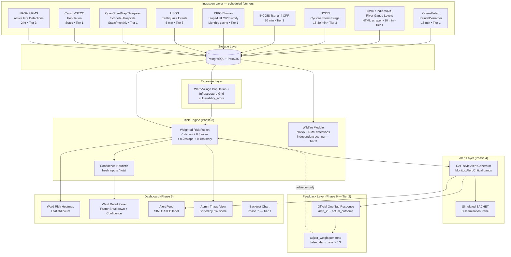

# PRAHARI-AI — Architecture Reference

*(Build Guide §1.1 — layer-by-layer system design)*

---

## System Architecture Diagram



---

## Layer Descriptions

### 1. Ingestion Layer

One independent scheduled fetcher module per data source (Build Guide §3.1). 
**Key isolation requirement:** one source failing cannot break another — every fetcher wraps its calls in per-unit try/except, and the APScheduler catches exceptions at the job level.

Tier 1 fetchers run on short intervals (15-30 min) and write to `hazard_readings`.  
Tier 3 fetchers are structurally identical but can be disabled (commented out of `scheduler.py`) without affecting Tier 1 data flow.

### 2. Storage Layer

**PostgreSQL 15 + PostGIS** — all geospatial operations (ward boundary spatial joins, point-in-polygon for OSM and FIRMS) are performed in the database rather than in Python, using PostGIS functions (`ST_Contains`, `ST_SetSRID`, etc.).

Key tables: `hazard_readings`, `wards`, `risk_scores`, `wildfire_scores`, `alerts`, `feedback`, `river_level_snapshot_cache`.

**Cache-first pattern** (Build Guide §3.5, §3.6): CWC river data and Bhuvan slope data are read from cache first; live fetch is attempted second. A fetch failure degrades to cached data, never to a blank.

### 3. Exposure Layer

Ward-level vulnerability grid combining:
- Population density from Census/SECC (static bulk load)
- Critical infrastructure count (schools + hospitals) from OSM via PostGIS spatial join
- Slope proxy from Bhuvan LULC statistics (monthly cache)

Vulnerability score formula (Build Guide §4.1):  
`vulnerability_score = (norm_pop_density × 0.6) + (norm_infra_count × 0.4)` [ASSUMPTION]

### 4. Risk Engine

**Weighted Risk Fusion Model** (Build Guide §5.1 — exact, never alter):
```
risk_score = 0.4 × rainfall_intensity
           + 0.3 × river_level_trend
           + 0.2 × slope_saturation_proxy
           + 0.1 × historical_incident_density
```

Per-factor contributions are the explainability output (Build Guide §5.5) — no additional library.

**Wildfire scoring is separate** (Build Guide §5.6): independent model writing to `wildfire_scores`, never merged into the four-factor formula.

### 5. Alert Layer

Risk scores are classified into three bands (Build Guide §6.1):
- Monitor (0-40): internal log only
- Alert (40-70): notify officials
- Critical (70-100): evacuate / close schools / activate pumps / alert NDRF

CAP-structured alerts (OASIS standard) generated for Alert and Critical bands.  
Dissemination panel is **SIMULATED** — no live SACHET connection in the MVP.

### 6. Feedback Layer (Tier 2)

One-tap official feedback captured per alert. `adjust_weight()` reduces over-predicting factor weights by 0.05 (floor: 0.05) when `false_alarm_rate > 0.3` for a zone. Before/after comparison shown in dashboard.

### 7. Dashboard

Four required views (Build Guide §5):
1. Ward risk heatmap (Leaflet)
2. Ward click-through panel: score + confidence + 4-factor breakdown
3. Alert feed (labelled SIMULATED)
4. Admin triage list (sorted by risk score)

Tier 3 hazard layers (wildfire, tsunami, earthquake) are toggleable/removable without breaking Tier 1 views.

---

## Geospatial Stack (Build Guide §1.1, §1a.3)

| Tool | Role |
|---|---|
| PostGIS | Spatial queries — ward boundaries, point-in-polygon joins |
| GeoAlchemy2 | SQLAlchemy integration for PostGIS geometry types |
| Leaflet | Interactive map rendering in the React dashboard |
| QGIS | Offline grid-overlay analysis and multi-district spatial work |
| Vector Tiles | Future scaling approach for multi-district map data delivery (OPTIONAL ENHANCEMENT) |
